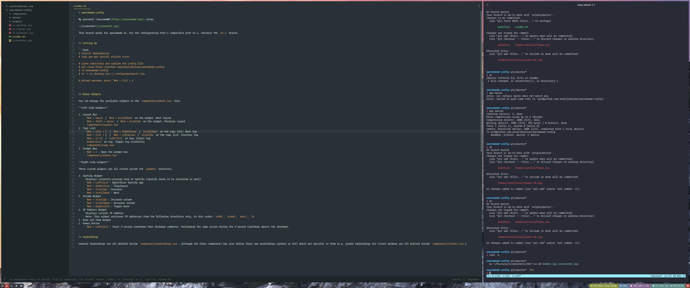

# awesomewm-config

My personal [AwesomeWM](https://awesomewm.org/) setup.



This branch works for awesomewm v4. For the configuration that's compatible with v3.x, checkout the `v3.x` branch.


## Setting Up

```bash
# Install dependencies
$ sudo apt-get install xtrlock scrot

# Clone repository and symlink the config file
$ git clone https://github.com/arnellebalane/awesomewm-config
$ cd awesomewm-config
$ ln -s rc.desktop.lua ~/.config/awesome/rc.lua

# Reload awesome, press `Mod + Ctrl + r`
```


## Wibar Widgets

You can manage the available widgets in the `components/wibars.lua` file.

**Left-side widgets**

1. Layout Box
   - `Mod + Space` / `Mod + ScrollDown` on the widget: Next layout
   - `Mod + Shift + Space` / `Mod + ScrollUp` on the widget: Previous layout
   - `components/layouts.lua`
1. Tags List
   - `Mod + Ctrl + l` / `Mod + RightArrow` / `ScrollDown` on the tags list: Next tag
   - `Mod + Ctrl + h` / `Mod + LeftArrow` / `ScrollUp` on the tags list: Previous tag
   - `Mod + {1-4}` / `LeftClick` on tag: Select tag
   - `RightClick` on tag: Toggle tag visibility
   - `components/tags.lua`
1. Prompt Box
   - `Mod + r`: Open the prompt box
   - `components/wibars.lua`

**Right-side widgets**

These custom widgets are all stored inside the `widgets` directory.

1. Spotify Widget
   - Displays currently-playing song on Spotify (Spotify needs to be installed as well)
   - `Mod + LeftClick`: Open/focus Spotify app
   - `Mod + RightClick`: Play/pause
   - `Mod + ScrollUp`: Previous
   - `Mod + ScrollDown`: Next
1. Volume Widget
   - `Mod + ScrollUp`: Increase volume
   - `Mod + ScrollDown`: Decrease volume
   - `Mod + RightClick`: Toggle mute
1. IP Address Widget
   - Displays current IP address
   - Note: This widget retrieves IP addresses from the following interfaces only, in this order: `eth0`, `wlan0`, `eno1`, `lo`
1. Date and Time Widget
1. Power Button
   - `Mod + LeftClick`: Start 3-second countdown then shutdown computer. Performing the same action during the 3-second countdown aborts the shutdown.


## Keybindings

General keybindings are all defined inside `components/keybindings.lua`, although the other components may also define their own keybindings (global or not) which are specific to them (e.g. global keybindings for client windows are all defined inside `components/clients.lua`).
